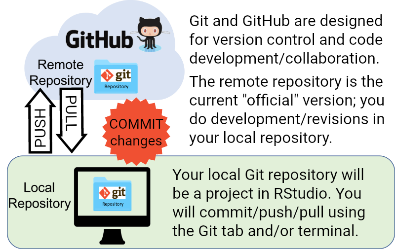

<style>
/* line 600, ../scss/default.scss */
.prettyprint .com {
  /* a comment */
  color: black;
  font-style: normal;
}
/* line 604, ../scss/default.scss */
.prettyprint .str {
  /* a string */
  color: black;
}
</style>

##

<p style="text-align: center;"></p>

<p style="text-align: center;">Log into your GitHub account at https://github.com<p style="text-align: center;">

<p style="text-align: center;">Log into the RStudio server at https://mathr.math.appstate.edu<p style="text-align: center;">


##

<p style="text-align: center;"></p>
<sub>note: image modified from [OSS 2017](https://www.nceas.ucsb.edu/~brun/OSS17_curriculum/version-control.html)</sub>


## Funny but true?

<p style="text-align: center;"></p>


## Commit Name and Email

Okay, this part we need to do in a terminal in RStusio. You may also refer to Chapter 11 of **[Happy Git and GitHub for the useR](http://happygitwithr.com/)** or **[GitHub](https://help.github.com/) Help**. 

In RStudio, choose Tools > Terminal > New Terminal

In the terminal, type the following at the prompt and hit [Enter] after each. 

```{r, eval=FALSE}
git config --global user.email "who@where"
git config --global user.name "commitname"
git config --global --list
```

These set an **[email](https://help.github.com/articles/setting-your-commit-email-address-in-git/)** and **[name](https://help.github.com/articles/setting-your-username-in-git/)** linked with any commit you make in Git. They do not have to be the same as your primary GitHub email and username. You can change them later.


## Cache Those Credentials

Would you prefer not to repeatedly type in your username and password? Me too!

In the terminal, type the following at the promptand hit [Enter].

```{r, eval=FALSE}
git config --global credential.helper 'cache --timeout=10000000'
```

The timeout value is 10 million.

This will store your password for ten million seconds, which is about 16 weeks, enough for a semester. 

The `global` option means the cache should apply to all of your `git` version-controlled projects. 


## Coming Out of Your Shell

Chapter 10 and Appendix A of **[Happy Git and GitHub for the useR](http://happygitwithr.com/)** discusses how to use shell commands to clone, commit, push, etc. These are also covered in the DataCamp course. 

We will discuss how to use the point and click Git interface in RStudio, which can be found in Chapter 13.

You will create a new **project** in RStudio with version control enabled. That is where you will clone your Git repository. You will do any related work in this project. 

You may want to create a subdirectory in your **Home** directory in RStudio for all your version controlled projects. For example, my directory **git_repositories**.

There is a nice discussion about working with R projects **[here](https://support.rstudio.com/hc/en-us/articles/200526207-Using-Projects)**.


## Let's Make a Repository

From the main GitHub page...

* choose the “Start a project” (or green "New") button
* create a new repository named __datascience1repo__
* add a description like "this my practice repository"
* choose "Public" or "Private" (if you have private access)
* choose "Initialize this repository with a README"
* click the green "Create repository" button (_drum roll..._)

Adding a license is optional. If you want one, the [MIT license](https://opensource.org/licenses/MIT) is a good general purpose license.


## Clone it !

In your GitHub **datascience1repo**... 

* choose the green “Clone or Download” button in your repo

    * select "Use HTTPS"
    * copy the HTTPS clone URL to your clipboard 

<p style="text-align: center;"></p>

Note: You can use SSH authentication if you want to. There's a GitHub page **[here](https://help.github.com/articles/which-remote-url-should-i-use/)** that discusses the differences.


## Let's Make a Project

In RStudio... 

* choose File > New Project > Version Control > Git

* paste in the repository URL from the the clipboard where it says "Repository URL:"

* the project directory name should be filled in automatically if you use CTRL-V to paste, otherwise you will have to type it in under "Project directory name:"

* choose your version control subdirectory, if you made one, where it says "Create project as a subdirectory of:"

* click Create Project!


## Create, Commit, Push, Pull

I'm just going to talk here for now, so follow along...

Changes made in RStudio are *pushed* to GitHub. Changes made in GitHub are *pulled* to RStudio. You must *commit* your changes before you push or pull.

<p style="text-align: center;"></p>


## Commit-iquette

Suggesttions adapted from [How to use GitHub like a proper human being](https://stories.devacademy.la/how-to-use-github-like-a-proper-human-being-1a9c895c4e13)

* Keep commits atomic. A commit should revolve around ONE change. If you have to add “and” you’ve committed too much.

* Capitalize the first word your commit message. Sentence case is more professional and easier to read. 

* Keep your commit message under 50 characters.

* Do not end your commit message with a period.

* Use an imperative commit message, like a command.

* Use consistent language in your commit messages.

